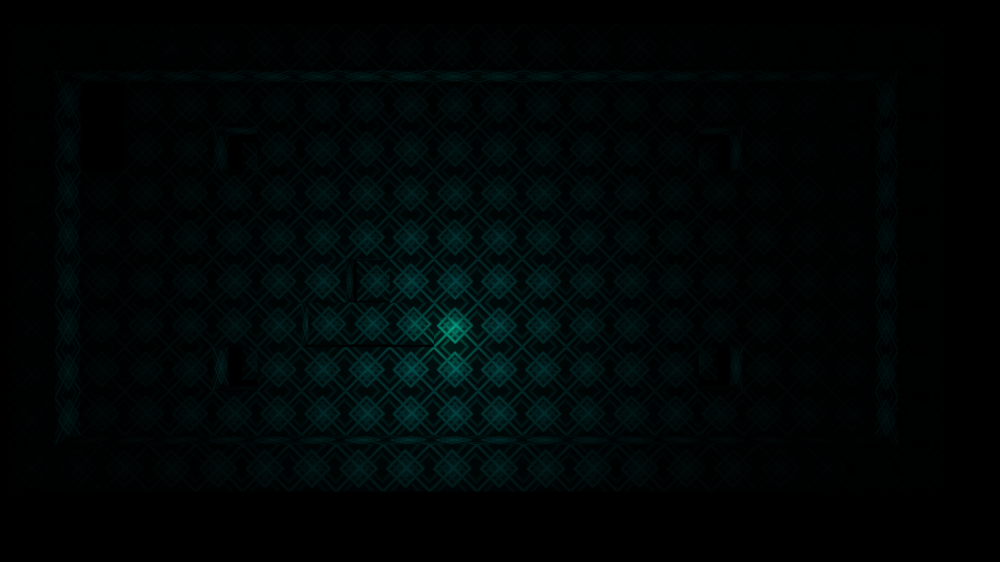
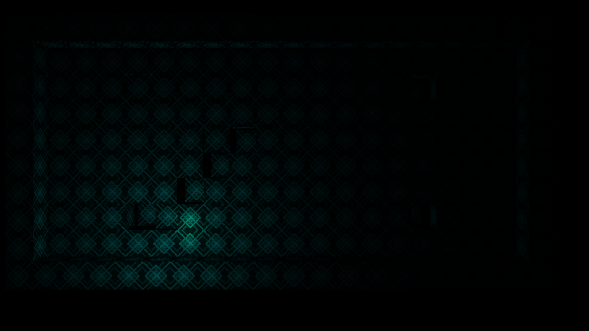
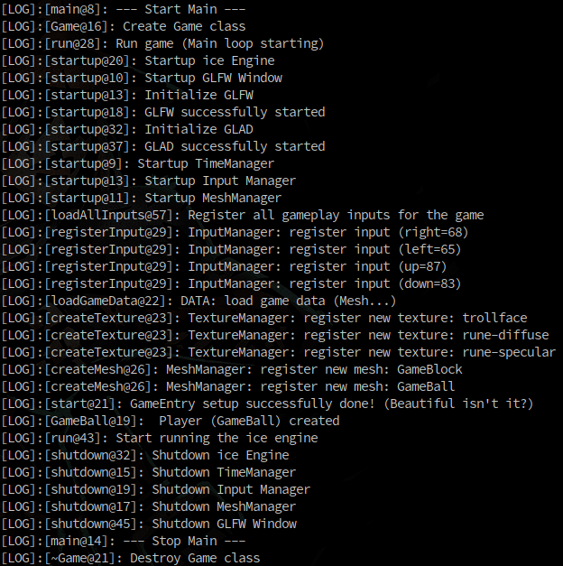

# Ice Engine 3D
A C++ 3D engine with OpenGL


# Description
This is a 3D game engine made from scratch during the CreativeJam 2018.
We had 46 hours to create a full game, and here is barely the engine.
There is a little demo though!
Compile and run the executable to test it (Linux only).
You don't have much other goals than moving around... (Best gameplay ever!)
But wait, everything was made from scratch!
(Or almost, we use OpenGL, glfw, and, glm. Fortunately, we were not required to create the computer by our own)
You may enjoy the beautiful handmade lighting (Phong Illumination algorithm).
The physic engine runs at 45fps. The rendering loop, on the other hand, runs as fast as possible.
This is a very good news if your living room is cold, since the engine will use 100% of one CPU to heat your computer, and the room on the way.
After a while, you may be able to cook some bacon on your computer, but we didn't try it in practice.


# Features
- Engine
    - Subsystems
        - TimeManager
        - MeshManager
        - TextureManager
        - InputManager
        - WindowGLFW
    - Camera
    - Game
    - Texture
    - Mesh
- Gameplay
    - GameObject
        - Update
        - FixedUpdate
    - GamePhysic
- Shaders
    - Phong Illumination (with PointLight)
- Demo (move with AWDS on keyboard)


# Demo
- Move the light with `A W D S` on the keyboard
- The walls push you away
- Cubes under you possition fall
- There is literally nothing more to do (it's only a demo)


# Dependencies
- OpenGL 3.3 (e.g., use `glxinfo` to check if supported)
- glfw3 (must be installed system-wide)
- glm (already in code)
- glad (already in code)
- stb image (already in code)


# Build and run with CMake (Linux only)
> Requires C++11.  
> Requires `pragma once` support.  
> Requires CMake 2.8.2 or more (tested with 3.10).  

```bash
mkdir build
cd build
cmake ..
make -j4
make run

# Or use build script
./build.sh

# If OpenGL 3.3 is supported but not selected, you can force it with
MESA_GL_VERSION_OVERRIDE=3.3 ./build.sh
```


# Screenshots






# Authors
- Constantin Masson ([constantinmasson.com](http://constantinmasson.com/))
- Gaetan ([Ashijo](https://github.com/Ashijo))


